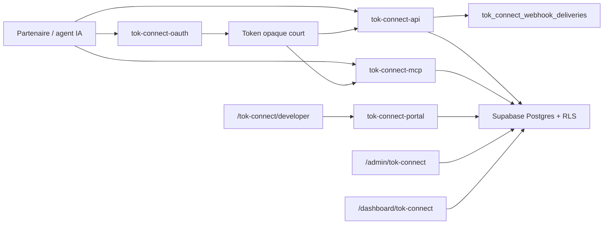

# TOK Connect

TOK Connect est le socle d'integration partenaire de TOK. Son objectif est de transformer TOK en plateforme exploitable par des applications tierces, des conciergeries, des hotels, des agents IA, des CRM et des outils restaurateurs, sans exposer directement la base Supabase ni permettre d'actions autonomes non controlees.

La v1 implementee dans cette branche livre un produit prudent: API REST, OAuth client-credentials, MCP Server, portail developpeur, consentements restaurateurs, supervision admin, logs, quotas, idempotence et webhooks signes. Les lectures, previews et reservations confirmees sont reelles. Les actions autonomes type offres, campagnes publiees, MIAMZ ou Zero Attente autopilote restent hors production v1.

## Sommaire

- [Vision produit](#vision-produit)
- [Socle livre](#socle-livre)
- [Architecture](#architecture)
- [Routes frontend](#routes-frontend)
- [Feature flags](#feature-flags)
- [Modele de donnees](#modele-de-donnees)
- [Securite et permissions](#securite-et-permissions)
- [OAuth 2.0 client-credentials](#oauth-20-client-credentials)
- [API REST v1](#api-rest-v1)
- [MCP Server](#mcp-server)
- [Webhooks](#webhooks)
- [Sandbox](#sandbox)
- [Portail developpeur](#portail-developpeur)
- [Vue admin](#vue-admin)
- [Consentement restaurateur](#consentement-restaurateur)
- [Observabilite](#observabilite)
- [Tests et validation](#tests-et-validation)
- [Ce qui reste a mettre en place](#ce-qui-reste-a-mettre-en-place)
- [Runbook de livraison](#runbook-de-livraison)
- [Fichiers principaux](#fichiers-principaux)

## Vision produit

TOK Connect doit permettre a un partenaire approuve de consommer les capacites TOK sans casser les garde-fous du produit:

- decouvrir les restaurants actifs;
- lire les menus publics;
- verifier les disponibilites de reservation;
- preparer une reservation;
- creer une reservation uniquement apres confirmation explicite de l'utilisateur final;
- lire un solde de credits ou estimer un cout;
- generer une preview de campagne sans publication automatique;
- brancher un agent IA via MCP avec des tools limites;
- recevoir des evenements sortants signes.

Le positionnement est restaurateur-first: un restaurant garde le controle des partenaires autorises, des scopes, des limites de reservation, du MCP et de la revocation.

## Socle livre

Le socle actuel est compose de cinq couches:

1. **Base Supabase**: nouvelles tables `tok_connect_*`, RLS, indexes, helper functions et feature flags.
2. **Edge Functions publiques**: OAuth, API REST, MCP et portail developpeur.
3. **Frontend**: page publique, portail developpeur, vue admin et vue restaurateur.
4. **Helpers partages**: enveloppe de reponse, scopes, tokens, hashing, signatures webhook, pagination, idempotence.
5. **Tests**: contrats SQL, runtime, Edge Functions, frontend et catalogue public.

Ce socle rend TOK Connect utilisable localement et deployable via le workflow habituel. Il ne pousse pas la production depuis Codex et ne modifie aucun secret.

## Architecture



Les partenaires ne lisent pas directement les tables sensibles. Les mutations sensibles passent par Edge Functions avec service role cote serveur. Le navigateur utilise seulement les routes autorisees par RLS ou le portail Edge.

## Routes frontend

### `/tok-connect`

Page publique de presentation. Elle expose:

- le positionnement API + MCP prudent;
- les endpoints REST v1;
- les tools MCP autorises;
- les webhooks signes;
- les garde-fous de securite;
- le lien vers le portail developpeur.

### `/tok-connect/developer`

Portail authentifie. Il permet:

- de charger un overview partenaire;
- de creer un client OAuth sandbox;
- de recuperer le secret une seule fois;
- de faire une rotation de secret;
- de creer un endpoint webhook sandbox;
- de consulter les clients, logs API et endpoints;
- de lire un extrait OpenAPI et un exemple MCP.

Cette route est protegee par `ProtectedRoute` et par le feature flag `tok-connect`.

### `/admin/tok-connect`

Vue admin protegee par `AdminProtectedRoute` et `admin-tok-connect`. Elle lit les partenaires, logs API, grants restaurants et livraisons webhook avec limites explicites. La v1 est surtout une console de supervision.

### `/dashboard/tok-connect`

Vue restaurateur protegee par `DashboardRoute` et `dashboard-tok-connect`. Elle liste les grants du restaurant selectionne et permet d'autoriser ou revoquer un partenaire existant, sous RLS `auth_owns_restaurant(restaurant_id)`.

## Feature flags

La migration seed les flags suivants:

| Flag | Role |
| --- | --- |
| `tok-connect` | Active la page publique et le portail developpeur. |
| `tok-connect-api` | Active le perimetre API REST dans le catalogue produit. |
| `tok-connect-mcp` | Active le perimetre MCP prudent. |
| `tok-connect-webhooks` | Active le perimetre webhooks sortants. |
| `tok-connect-autopilot` | Reste force a `false` en v1. |
| `dashboard-tok-connect` | Active la page de consentement restaurateur. |
| `admin-tok-connect` | Active la supervision admin. |

Important: les Edge Functions critiques lisent maintenant les flags a chaque requete. `tok-connect` protege le portail, `tok-connect-api` protege OAuth/API REST, `tok-connect-mcp` protege le serveur MCP et `tok-connect-webhooks` protege la configuration et le dispatch webhook. Si un flag est desactive, la fonction refuse proprement l'action.

## Modele de donnees

La migration `20260626101032_tok_connect_foundation.sql` cree dix tables.

### `tok_connect_partners`

Un partenaire TOK Connect: developpeur sandbox, hotel, concierge, CRM, agence, integration enterprise.

Champs importants:

- `status`: `pending`, `active`, `suspended`, `revoked`;
- `environment`: `sandbox` ou `production`;
- `billing_tier`: niveau commercial;
- `approved_by`, `approved_at`: future validation admin;
- `metadata`: extensions non bloquantes.

### `tok_connect_clients`

Client OAuth rattache a un partenaire.

Champs importants:

- `client_id`: identifiant public du client;
- `client_secret_hash`: hash du secret;
- `allowed_scopes`: scopes maximaux;
- `token_ttl_seconds`: TTL entre 60 et 3600 secondes;
- `status`: `active`, `suspended`, `revoked`;
- `last_rotated_at`: rotation.

Le secret brut n'est affiche qu'une fois par le portail.

### `tok_connect_partner_members`

Membres humains d'un partenaire.

Roles:

- `owner`;
- `developer`;
- `viewer`.

La v1 cree automatiquement un membre `owner` quand un utilisateur cree son sandbox.

### `tok_connect_restaurant_grants`

Consentement d'un restaurant envers un partenaire.

Champs importants:

- `allowed_scopes`: scopes autorises par restaurant;
- `status`: `pending`, `active`, `suspended`, `revoked`;
- `allow_mcp`: autorisation MCP;
- `max_daily_reservations`;
- `max_party_size`;
- `expires_at`.

La v1 permet surtout d'activer ou revoquer un grant deja cree.

### `tok_connect_access_tokens`

Tokens opaques emis par `tok-connect-oauth`.

Champs importants:

- `token_hash`: hash du token opaque;
- `scopes`: scopes emis;
- `expires_at`;
- `revoked_at`;
- `last_used_at`;
- `request_metadata`.

Le token brut n'est jamais stocke.

### `tok_connect_api_requests`

Journal des appels API et MCP.

Champs importants:

- `request_id`;
- `method`;
- `route`;
- `status_code`;
- `latency_ms`;
- `scopes`;
- `restaurant_id`;
- `idempotency_key`;
- `error_code`;
- `request_metadata`.

### `tok_connect_idempotency_keys`

Stocke les idempotency keys pour les operations critiques, notamment `POST /v1/reservations`.

Champs importants:

- `key`;
- `operation`;
- `request_hash`;
- `response_body`;
- `status_code`;
- `resource_type`;
- `resource_id`;
- `expires_at`.

La contrainte `UNIQUE (client_id, key)` evite les doubles creations.

### `tok_connect_webhook_endpoints`

Endpoint webhook configure par partenaire.

Champs importants:

- `url`;
- `events`;
- `signing_secret`;
- `status`: `active`, `paused`, `revoked`;
- `last_rotated_at`.

Note: le secret de signature est stocke brut pour permettre la signature des livraisons. La lecture directe partenaire est bloquee par RLS/policies; le portail passe par Edge Function. A terme, il faut migrer vers Supabase Vault ou un secret reference/chiffre.

### `tok_connect_webhook_deliveries`

File de livraisons webhook.

Champs importants:

- `endpoint_id`;
- `event_type`;
- `payload`;
- `status`: `pending`, `delivered`, `failed`, `cancelled`;
- `attempts`;
- `next_retry_at`;
- `last_attempted_at`;
- `response_status`;
- `response_body`;
- `signature`.

La v1 enfile les livraisons et inclut le worker `tok-connect-webhook-dispatch` pour envoyer les POST signes, appliquer le retry/backoff et marquer `delivered` ou `failed`.

### `tok_connect_agent_runs`

Trace des executions MCP ou previews IA.

Champs importants:

- `mode`: `read_only`, `suggest`, `preview`;
- `tool_name`;
- `status`;
- `input`;
- `output`;
- `approval_required`.

## Securite et permissions

### RLS

Toutes les nouvelles tables activent RLS.

Principes appliques:

- `anon` est revoke sur toutes les tables TOK Connect;
- `service_role` conserve l'acces complet pour les Edge Functions;
- les admins peuvent superviser les tables;
- les partenaires peuvent lire certaines donnees non secretes via policies;
- les restaurateurs peuvent lire et mettre a jour les grants de leurs propres restaurants;
- les secrets, tokens et idempotency keys ne sont pas exposes directement aux partenaires.

### Helper functions SQL

Deux helpers sont crees:

- `tok_connect_is_partner_member(p_partner_id uuid)`;
- `tok_connect_restaurant_grant_enabled(p_partner_id uuid, p_restaurant_id uuid, p_scope text)`.

Ils sont `SECURITY DEFINER` avec `SET search_path = public` pour eviter les problemes classiques de RLS recursive et de search path.

### Service role

Les mutations sensibles sont faites par Edge Functions:

- emission de token;
- creation/rotation de secret;
- creation endpoint webhook;
- reservation reelle;
- insertion logs;
- insertion idempotency key;
- insertion deliveries webhook;
- insertion agent runs.

Le frontend ne recoit jamais de service role key.

### Hashing et signatures

Helpers principaux:

- `hashTokConnectSecret`: SHA-256 base64url prefixe `tokc_sha256:`;
- `verifyTokConnectSecret`: verification constant-time;
- `createTokConnectAccessToken`: token opaque;
- `createTokConnectClientCredential`: client id, secret client, webhook secret;
- `signTokConnectWebhook`: HMAC SHA-256 sur `timestamp.payload`.

## OAuth 2.0 client-credentials

Edge Function: `tok-connect-oauth`.

### Requete

```http
POST /functions/v1/tok-connect-oauth
Content-Type: application/x-www-form-urlencoded

grant_type=client_credentials&client_id=tokc_client_xxx&client_secret=tokc_secret_xxx&scope=restaurants:read availability:read
```

Le JSON est aussi accepte.

### Validation

La fonction verifie:

- methode `POST`;
- `grant_type=client_credentials`;
- presence `client_id` et `client_secret`;
- rate limit par client;
- existence du client;
- statut client `active`;
- secret valide;
- partenaire actif;
- scopes demandes inclus dans `allowed_scopes`.

### Reponse

```json
{
  "ok": true,
  "data": {
    "access_token": "tokc_at_xxx",
    "token_type": "Bearer",
    "expires_in": 900,
    "scope": "restaurants:read availability:read"
  },
  "error": null,
  "request_id": "tok_req_xxx",
  "next_cursor": null
}
```

Le token est opaque et court. Seul son hash est stocke dans `tok_connect_access_tokens`.

## API REST v1

Edge Function: `tok-connect-api`.

Toutes les reponses REST suivent cette enveloppe:

```json
{
  "ok": true,
  "data": {},
  "error": null,
  "request_id": "tok_req_xxx",
  "next_cursor": null
}
```

En erreur:

```json
{
  "ok": false,
  "data": null,
  "error": {
    "code": "missing_scope",
    "message": "missing_scope"
  },
  "request_id": "tok_req_xxx",
  "next_cursor": null
}
```

### Authentification

Chaque appel REST utilise:

```http
Authorization: Bearer tokc_at_xxx
```

La fonction verifie:

- presence du bearer token;
- hash du token;
- expiration;
- revocation;
- statut client;
- statut partenaire;
- scopes requis;
- rate limits partenaire et client.

### `GET /v1/restaurants`

Scope: `restaurants:read`.

Liste les restaurants actifs avec pagination.

Parametres:

- `limit`: defaut 25, maximum 100;
- `cursor`: curseur base64url;
- `city`: filtre ville;
- `cuisine`: filtre cuisine.

La pagination retourne `next_cursor` quand une page suivante existe.

### `GET /v1/restaurants/{id}`

Scope: `restaurants:read`.

Retourne le profil public d'un restaurant actif.

### `GET /v1/restaurants/{id}/menu`

Scope: `restaurants:read`.

Retourne les items de menu disponibles.

Parametres:

- `limit`: defaut 50, maximum 100.

### `GET /v1/restaurants/{id}/availability`

Scope: `availability:read`.

Lit les disponibilites via RPC `get_restaurant_reservation_slot_availability`.

Parametres:

- `date`: date ISO, defaut aujourd'hui.

### `POST /v1/reservations/preview`

Scope: `reservations:create`.

Prepare une reservation sans mutation.

Champs requis:

- `restaurant_id`;
- `date`;
- `time`;
- `party_size`.

La preview indique que la confirmation utilisateur est requise.

### `POST /v1/reservations`

Scope: `reservations:create`.

Cree une reservation reelle apres confirmation.

Headers requis:

```http
Idempotency-Key: stable-key-par-operation
```

Champs requis:

- `restaurant_id`;
- `date`;
- `time`;
- `party_size`;
- `confirmed_by: "end_user"`.

Comportement:

1. verifie l'idempotency key;
2. refuse sans confirmation utilisateur;
3. en sandbox, cree une reservation fixture;
4. en production, appelle `validate_and_create_reservation_safe`;
5. stocke la reponse dans `tok_connect_idempotency_keys`;
6. enfile un webhook `reservation.created`;
7. ecrit un audit log.

### `POST /v1/reservations/{id}/cancel/preview`

Scope: `reservations:cancel`.

Preview d'annulation sans mutation. L'annulation reelle n'est pas encore livree en v1.

### `GET /v1/credits/balance`

Scope: `credits:read`.

Retourne un solde de credits. En sandbox, le solde est deterministe. En production, le branchement au vrai ledger de credits reste a finaliser.

### `POST /v1/campaigns/preview`

Scope: `campaigns:preview`.

Cree une preview de campagne sans publication automatique.

Champs requis:

- `restaurant_id`;
- `objective`.

Optionnel:

- `budget_chf`.

Comportement:

- estime un cout en credits;
- marque `requires_human_approval`;
- insere une ligne dans `tok_connect_agent_runs`;
- enfile un webhook `campaign.previewed`.

## MCP Server

Edge Function: `tok-connect-mcp`.

Transport: JSON-RPC HTTP.

Version protocole annoncee: `2025-06-18`.

### Methodes supportees

- `initialize`;
- `tools/list`;
- `tools/call`;
- `resources/list`;
- `resources/read`;
- `prompts/list`;
- `prompts/get`.

### Tools v1

| Tool | Scopes | Mode |
| --- | --- | --- |
| `search_restaurants` | `restaurants:read` | lecture |
| `get_real_time_availability` | `availability:read` | lecture |
| `prepare_reservation` | `reservations:create` | suggestion |
| `get_restaurant_performance` | `analytics:read` | lecture |
| `estimate_campaign_credit_cost` | `credits:read`, `campaigns:preview` | lecture |
| `generate_campaign_preview` | `campaigns:preview` | suggestion |

### Garde-fous MCP

- aucun tool ne publie une campagne;
- aucun tool ne cree directement une offre;
- `prepare_reservation` retourne une preview, pas une reservation confirmee;
- `generate_campaign_preview` exige validation humaine;
- les executions de preview sont tracees dans `tok_connect_agent_runs`;
- les scopes sont verifies a chaque `tools/call`.

### Exemple

```json
{
  "jsonrpc": "2.0",
  "id": 1,
  "method": "tools/call",
  "params": {
    "name": "prepare_reservation",
    "arguments": {
      "restaurant_id": "00000000-0000-4000-8000-000000000101",
      "date": "2026-06-26",
      "time": "19:30",
      "party_size": 2
    }
  }
}
```

## Webhooks

Evenements v1:

- `reservation.created`;
- `reservation.cancelled`;
- `webhook.test`;
- `campaign.previewed`.

Headers prevus:

- `X-TOK-Event`;
- `X-TOK-Delivery`;
- `X-TOK-Timestamp`;
- `X-TOK-Signature`.

Signature:

```text
v1=base64url(HMAC_SHA256(secret, timestamp + "." + payload))
```

Etat actuel:

- les endpoints sont configurables dans le portail;
- les deliveries sont enfilees dans `tok_connect_webhook_deliveries`;
- la signature est calculee avec `X-TOK-Event`, `X-TOK-Delivery`, `X-TOK-Timestamp` et `X-TOK-Signature`;
- `tok-connect-webhook-dispatch` lit les deliveries `pending`, envoie les POST HTTP, applique timeout/retry/backoff et marque `delivered`, `failed` ou `pending` avec `next_retry_at`;
- le portail permet d'enfiler un `webhook.test`.

## Sandbox

Un client OAuth peut etre en `environment = sandbox`.

Effets:

- restaurants fixtures deterministes;
- menu fixtures;
- disponibilites fixtures;
- reservation sandbox sans mutation production;
- credits sandbox;
- quotas sandbox;
- secrets affiches une seule fois.

Le portail developpeur cree automatiquement:

1. un partenaire `TOK Connect Sandbox` si l'utilisateur n'en a pas;
2. un membre `owner`;
3. un client OAuth sandbox.

## Portail developpeur

La route `/tok-connect/developer` appelle `tok-connect-portal`.

Actions supportees:

- `overview`;
- `create-sandbox-client`;
- `rotate-client-secret`;
- `revoke-client`;
- `create-webhook-endpoint`;
- `send-webhook-test`;
- `approve-partner` pour les admins;
- `suspend-partner` pour les admins;
- `revoke-partner` pour les admins.

### `overview`

Retourne:

- memberships partenaire;
- clients;
- logs API;
- endpoints webhook;
- deliveries webhook;
- quotas.

### `create-sandbox-client`

Cree:

- partenaire sandbox si besoin;
- client OAuth sandbox;
- scopes sandbox;
- secret affiche une seule fois.

### `rotate-client-secret`

Remplace le hash du secret client et retourne le nouveau secret une seule fois.

### `revoke-client`

Passe le client a `revoked` et renseigne `revoked_at` sur les tokens actifs du client. L'action est disponible au membre partenaire autorise et a l'admin.

### `create-webhook-endpoint`

Cree un endpoint webhook avec secret de signature affiche une seule fois.

Validation URL:

- `https://` requis;
- `http://localhost` et `http://127.0.0.1` acceptes pour le local.

### `send-webhook-test`

Enfile une delivery `webhook.test` signee et dispatchable par `tok-connect-webhook-dispatch`.

## Vue admin

La page `/admin/tok-connect` lit:

- `tok_connect_partners`;
- `tok_connect_clients`;
- `tok_connect_api_requests`;
- `tok_connect_restaurant_grants`;
- `tok_connect_webhook_deliveries`.

Limites:

- 50 partenaires;
- 100 logs API;
- 100 livraisons webhook;
- 100 grants.

Etat actuel:

- supervision lecture paginee;
- actions admin via `tok-connect-portal`: approuver, suspendre ou revoquer un partenaire;
- revocation client avec invalidation des tokens actifs;
- visibilite des garde-fous;
- edition fine des quotas, billing tier, scopes et grants depuis l'admin encore a completer.

## Consentement restaurateur

La page `/dashboard/tok-connect` lit les grants du restaurant courant.

Actions:

- passer un grant a `active`;
- passer un grant a `revoked`.

La mutation est protegee par RLS:

```sql
public.auth_owns_restaurant(restaurant_id) OR public.auth_is_admin()
```

Etat actuel:

- consentement minimal utilisable;
- les operations API/MCP sensibles imposent le grant restaurant en production;
- les limites `max_party_size`, `max_daily_reservations` et `allow_mcp` sont appliquees par les Edge Functions;
- pas encore de creation de grant depuis l'UI restaurateur;
- pas encore d'edition fine des scopes, limites et expiration depuis l'UI.

## Observabilite

### Logs API

Chaque appel REST et MCP doit etre trace dans `tok_connect_api_requests` avec:

- request id;
- route;
- methode;
- status code;
- latence;
- scopes;
- restaurant id;
- idempotency key;
- code erreur.

### Audit logs

Les Edge Functions ecrivent dans `edge_function_audit_logs` pour:

- emission token OAuth;
- creation client sandbox;
- rotation secret;
- creation endpoint webhook;
- creation reservation reelle;
- erreurs portail.

### Agent runs

Les previews campagne et certaines operations MCP sont tracees dans `tok_connect_agent_runs`.

## Tests et validation

Tests ajoutes:

- `src/test/tok-connect.test.ts`;
- `src/test/tok-connect-runtime.test.ts`;
- `src/test/tok-connect-sql.test.ts`;
- `src/test/tok-connect-edge-functions.test.ts`;
- `src/test/tok-connect-frontend.test.ts`.

Validation effectuee sur cette branche:

- `deno check supabase/functions/tok-connect-oauth/index.ts supabase/functions/tok-connect-api/index.ts supabase/functions/tok-connect-mcp/index.ts supabase/functions/tok-connect-portal/index.ts supabase/functions/tok-connect-webhook-dispatch/index.ts`;
- `pnpm exec vitest run src/test/tok-connect-runtime.test.ts src/test/tok-connect-edge-functions.test.ts src/test/tok-connect-frontend.test.ts src/test/tok-connect-sql.test.ts`;
- `pnpm run lint`;
- `pnpm test`;
- `pnpm run build`;
- `pnpm run test:prod`;
- `pnpm run build:prod`;
- `pnpm run supabase:target:prod`;
- `pnpm run supabase:doctor:prod`;
- QA navigateur locale desktop/mobile sur `/tok-connect`;
- verification de redirection auth sur `/tok-connect/developer`.

Resultats connus:

- Vitest: 277 fichiers, 1079 tests passes;
- Supabase doctor production: OK;
- avertissement attendu: pas de lien CLI local dans `supabase/.temp`.

## Ce qui reste a mettre en place

### Critique avant production publique

1. **Planifier le dispatch webhook**
   - `tok-connect-webhook-dispatch` existe.
   - Il reste a le declencher via scheduler securise (`INTERNAL_CRON_SECRET`, pg_cron/pg_net ou workflow equivalent).
   - Verifier le rythme cible: par exemple toutes les minutes en production.

2. **Durcir les secrets webhook**
   - Remplacer `signing_secret` brut par Supabase Vault, chiffrement applicatif ou reference de secret.
   - Prevoir rotation endpoint webhook.
   - Ne jamais afficher l'ancien secret.

3. **Finaliser l'admin commercial**
   - Edition scopes, quotas, billing tier et environment.
   - Creation de grants restaurant depuis l'admin.
   - Detail partenaire, filtres, recherche et export logs.

4. **Tester les Edge Functions contre Supabase local**
   - Les tests actuels couvrent les contrats et le code statique.
   - Ajouter tests d'integration avec Supabase local ou environnement de test.
   - Verifier les RPC reelles `validate_and_create_reservation_safe`, `get_restaurant_reservation_slot_availability`, `get_restaurant_performance`.

### Important pour v1 commerciale

1. **OpenAPI enrichi**
   - Le document OpenAPI est affiche dans le portail.
   - Ajouter schemas complets, erreurs, scopes detailles et exemples curl.
   - Publier une version telechargeable `openapi.yaml` ou `openapi.json`.

2. **MCP conforme plus complet**
   - Ajouter les schemas de resources et prompts de facon plus stricte.
   - Verifier compatibilite avec clients MCP cibles.
   - Ajouter tests JSON-RPC plus exhaustifs.

3. **Quotas persistants**
   - Aujourd'hui rate limit via helper existant et valeurs code/env.
   - Ajouter quotas par client/partenaire dans la DB.
   - Surface admin pour edition.
   - Logs de consommation.

4. **Ledger credits**
   - `GET /v1/credits/balance` retourne un placeholder production.
   - Brancher le vrai solde TOK Credits.
   - Rendre l'estimation campagne coherente avec la facturation.

5. **Reservation cancellation reelle**
   - La v1 livre seulement `cancel/preview`.
   - Ajouter endpoint d'annulation reelle avec confirmation, idempotence, audit et webhook `reservation.cancelled`.

6. **UI developpeur plus complete**
   - Liste detaillee des tokens actifs sans afficher les secrets.
   - Copie curl.
   - Explorateur OpenAPI.
   - Console MCP.

7. **UI restaurateur plus fine**
   - Edition scopes par partenaire.
   - Edition limites quotidiennes.
   - Expiration.
   - Historique de changements.
   - Noms partenaires lisibles au lieu des IDs courts.

8. **UI admin plus fine**
   - Creation de grants.
   - Detail partenaire.
   - Recherche et filtres.
   - Export logs.
   - Alerting erreurs webhook.

### A reporter apres v1

1. **Authorization Code OAuth**
   - Delegation utilisateur/restaurant.
   - Consentement OAuth complet.
   - PKCE.
   - Refresh tokens.

2. **Autopilot controle**
   - Garder `tok-connect-autopilot` desactive tant que la gouvernance n'est pas terminee.
   - Ajouter approvals explicites.
   - Simulations marge.
   - Rollback.
   - Plafonds par restaurant.

3. **Marketplace partenaires**
   - Catalogue partenaires approuves.
   - Self-service onboarding.
   - Contrats et billing.

4. **SLA enterprise**
   - Quotas dedies.
   - Support prioritaire.
   - Observabilite avancee.
   - Dashboard statut.

## Runbook de livraison

### En local

```bash
pnpm install
pnpm dev
```

Tester:

- `http://127.0.0.1:5174/tok-connect`;
- `http://127.0.0.1:5174/tok-connect/developer`;
- `http://127.0.0.1:5174/admin/tok-connect`;
- `http://127.0.0.1:5174/dashboard/tok-connect`.

### Avant commit

```bash
pnpm run lint
pnpm test
pnpm run build
```

### Avant release

```bash
pnpm run test:prod
pnpm run build:prod
pnpm run supabase:target:prod
pnpm run supabase:doctor:prod
```

### Production

Ne pas pousser la DB depuis Codex. Les migrations et Edge Functions doivent partir par le workflow GitHub Actions du repo.

## Fichiers principaux

### Frontend

- `src/pages/TokConnect.tsx`: page publique.
- `src/pages/TokConnectDeveloper.tsx`: portail developpeur.
- `src/pages/admin/AdminTokConnect.tsx`: supervision admin.
- `src/pages/dashboard/DashboardTokConnect.tsx`: consentements restaurateur.
- `src/lib/tokConnect.ts`: catalogue produit, endpoints, tools, prompts, pricing, garde-fous.
- `src/lib/tokConnectOpenApi.ts`: document OpenAPI affiche dans le portail.
- `src/App.tsx`: routage.
- `src/lib/featureCatalog.ts`: flags et routes.
- `src/components/Navbar.tsx`: entree navigation.

### Supabase

- `supabase/migrations/20260626101032_tok_connect_foundation.sql`: schema, RLS, policies, flags.
- `supabase/migrations/20260626111842_tok_connect_v1_1_operations.sql`: colonnes et indexes de dispatch webhook/revocation.
- `supabase/config.toml`: declarations Edge Functions `verify_jwt = false`.
- `supabase/functions/tok-connect-oauth/index.ts`: OAuth client-credentials.
- `supabase/functions/tok-connect-api/index.ts`: API REST v1.
- `supabase/functions/tok-connect-mcp/index.ts`: MCP JSON-RPC HTTP.
- `supabase/functions/tok-connect-portal/index.ts`: portail developpeur.
- `supabase/functions/tok-connect-webhook-dispatch/index.ts`: dispatch HTTP signe des webhooks avec retry/backoff.
- `supabase/functions/_shared/tok-connect.ts`: helpers runtime.
- `supabase/functions/_shared/tok-connect-auth.ts`: auth bearer token, logs API, webhooks.
- `supabase/functions/_shared/auth.ts`: type client Edge explicite.
- `supabase/functions/_shared/cors.ts`: headers CORS TOK Connect.
- `supabase/functions/_shared/rate-limit.ts`: rate limiter compatible Edge client.

### Tests

- `src/test/tok-connect.test.ts`;
- `src/test/tok-connect-runtime.test.ts`;
- `src/test/tok-connect-sql.test.ts`;
- `src/test/tok-connect-edge-functions.test.ts`;
- `src/test/tok-connect-frontend.test.ts`.

## Resume d'etat

TOK Connect v1 est un socle fonctionnel, prudent et deployable par CI:

- API REST versionnee: en place;
- OAuth client-credentials: en place;
- MCP prudent: en place;
- sandbox developpeur: en place;
- reservations confirmees idempotentes: en place;
- previews campagne sans publication: en place;
- webhooks signes: enfilement, test et dispatch HTTP avec retry en place;
- admin: supervision, approbation/suspension/revocation partenaire et revocation client en place;
- restaurateur: autorisation/revocation minimale en place, enforcement API/MCP en place, edition fine restante;
- autopilot: explicitement desactive.

La prochaine tranche doit transformer ce socle en operation production complete: planification securisee du worker webhook, secrets webhook via Vault/chiffrement, edition fine admin/restaurateur, OpenAPI enrichi, quotas persistants et tests d'integration Supabase local.
